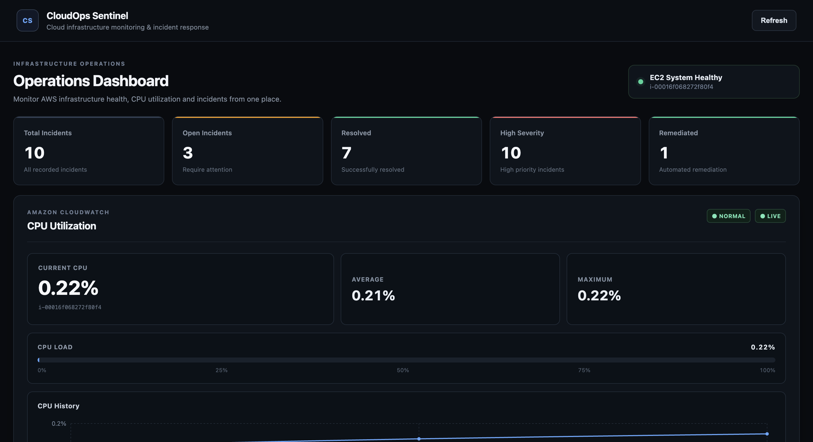
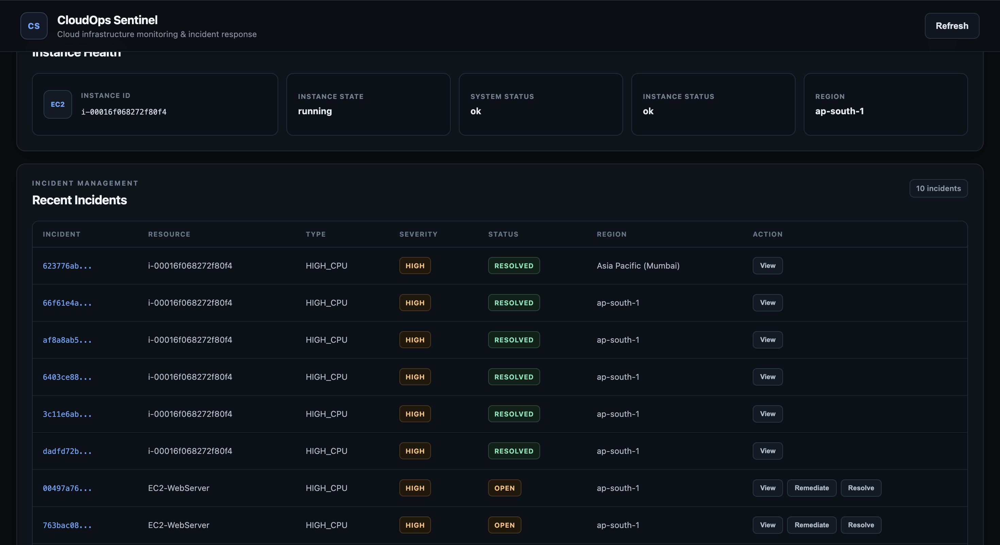
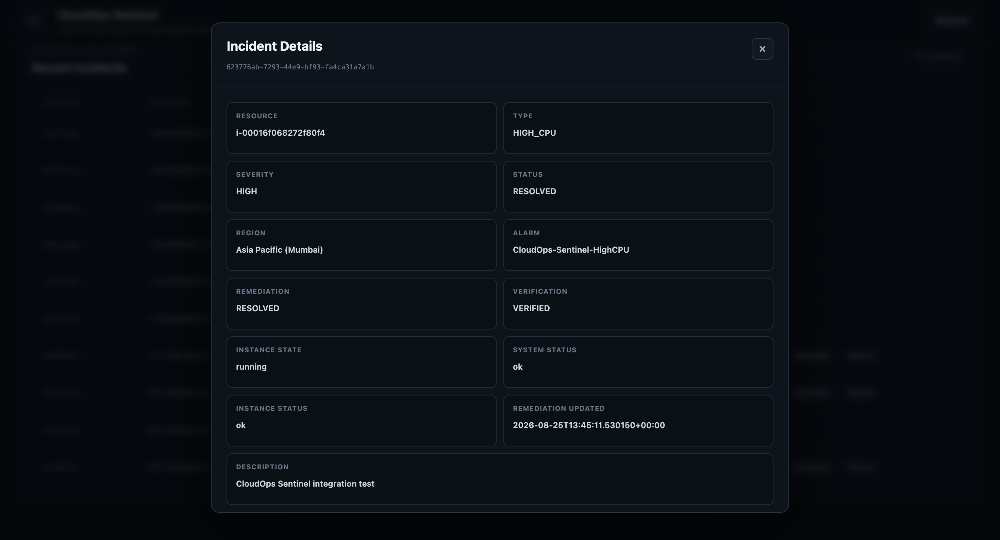
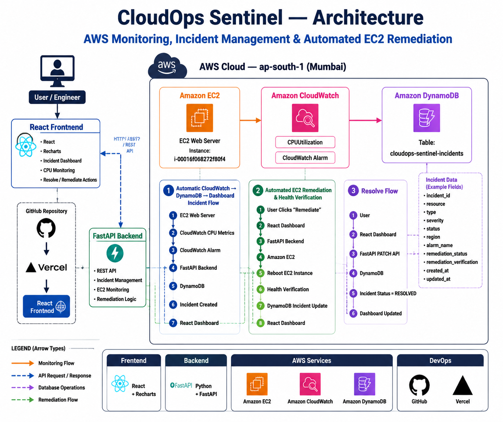

# CloudOps Sentinel

CloudOps Sentinel is an AWS infrastructure monitoring and automated incident-response platform.

It monitors EC2 health and CloudWatch CPU utilization, creates incidents in DynamoDB, and provides automated remediation through a web dashboard.

## Dashboard



## Incident Management



## Incident Details



## Architecture
CloudOps Sentinel uses AWS CloudWatch for monitoring, FastAPI for backend processing, DynamoDB for incident storage, and a React dashboard for visualization and incident management.



## Features

* AWS EC2 monitoring
* Amazon CloudWatch CPU monitoring
* CloudWatch alarm integration
* Automatic incident creation
* DynamoDB incident storage
* Incident dashboard
* Incident details modal
* Incident status tracking
* Resolve incidents
* Automated EC2 remediation
* EC2 reboot remediation
* EC2 health verification
* Remediation status tracking
* CPU utilization graph
* CPU history
* Recent CPU readings
* Infrastructure health status
* Dashboard summary statistics
* Automatic dashboard refresh

## Architecture

```text
                    AWS
                     |
             Amazon CloudWatch
                     |
               High CPU Alarm
                     |
                     v
              FastAPI Backend
                     |
          +----------+----------+
          |                     |
          v                     v
     Amazon EC2           DynamoDB
     Monitoring           Incidents
          |                     |
          |                     |
          +----------+----------+
                     |
                     v
              React Dashboard
                     |
          +----------+----------+
          |                     |
          v                     v
       Resolve              Remediate
                                |
                                v
                         EC2 Reboot
                                |
                                v
                       Health Verification
                                |
                                v
                           DynamoDB
                                |
                                v
                         Dashboard Update
```

## Technology Stack

### Frontend

* React
* Vite
* Recharts
* CSS

### Backend

* Python
* FastAPI
* Uvicorn
* Boto3

### AWS

* Amazon EC2
* Amazon CloudWatch
* Amazon DynamoDB
* AWS IAM

## Project Structure

```text
cloudops-sentinel/
│
├── backend/
│   ├── app/
│   │   ├── api/
│   │   │   ├── health.py
│   │   │   ├── incidents.py
│   │   │   └── routes.py
│   │   │
│   │   ├── models/
│   │   │   └── incident.py
│   │   │
│   │   ├── services/
│   │   │   └── aws_service.py
│   │   │
│   │   ├── config.py
│   │   └── main.py
│   │
│   └── requirements.txt
│
├── frontend/
│   ├── src/
│   │   ├── App.jsx
│   │   ├── App.css
│   │   └── main.jsx
│   │
│   ├── package.json
│   └── vite.config.js
│
├── .gitignore
└── README.md
```

## AWS Configuration

The backend requires AWS credentials with permission to access the required services.

Required AWS services:

* EC2
* CloudWatch
* DynamoDB

The DynamoDB table used by the project is:

```text
cloudops-sentinel-incidents
```

The application currently monitors an EC2 instance in:

```text
ap-south-1
```

## Environment Variables

Do not commit AWS credentials, API keys, passwords, `.env` files, virtual environments, or other sensitive information to GitHub.

Example backend environment variables:

```text
AWS_REGION=ap-south-1
DYNAMODB_TABLE=cloudops-sentinel-incidents
```

The actual values should be configured locally or through the deployment platform.

## Running the Backend

Create and activate the virtual environment:

```bash
cd backend
python3 -m venv .venv
source .venv/bin/activate
```

Install dependencies:

```bash
pip install -r requirements.txt
```

Start FastAPI:

```bash
uvicorn app.main:app --reload --port 8000
```

Backend:

```text
http://127.0.0.1:8000
```

API documentation:

```text
http://127.0.0.1:8000/docs
```

## Running the Frontend

Open another terminal:

```bash
cd frontend
npm install
npm run dev
```

The Vite development server will provide the frontend URL in the terminal.

## Dashboard API Endpoints

### Incidents

```text
GET /api/incidents
GET /api/incidents/{incident_id}
POST /api/incidents
PATCH /api/incidents/{incident_id}
```

### CloudWatch

```text
GET /api/cloudwatch/ec2/{instance_id}/cpu
```

### EC2

```text
GET /api/ec2/{instance_id}/status
POST /api/ec2/{instance_id}/reboot
```

### Monitoring and Remediation

```text
GET /api/monitor/ec2/{instance_id}
POST /api/ec2/{instance_id}/monitor-and-remediate
```

### Dashboard

```text
GET /api/dashboard/summary
```

## Incident Lifecycle

A typical incident follows this lifecycle:

```text
CloudWatch detects high CPU
        ↓
CloudWatch Alarm enters ALARM state
        ↓
FastAPI receives alarm
        ↓
Incident created in DynamoDB
        ↓
Dashboard displays OPEN incident
        ↓
Operator selects Remediate
        ↓
EC2 remediation executed
        ↓
EC2 health verified
        ↓
DynamoDB incident updated
        ↓
Incident becomes RESOLVED
        ↓
Dashboard refreshes
```

## Example Incident

```json
{
  "incident_id": "example-id",
  "resource": "i-xxxxxxxxxxxxxxxxx",
  "type": "HIGH_CPU",
  "severity": "HIGH",
  "status": "RESOLVED",
  "region": "ap-south-1"
}
```

## Security

Never commit:

```text
.env
.env.*
.aws/
credentials
access keys
secret keys
passwords
tokens
backend/.venv/
frontend/node_modules/
```

AWS credentials should be supplied through secure AWS credential configuration or environment variables.

## Deployment

### Frontend

The React/Vite frontend can be deployed to Vercel.

### Backend

The FastAPI backend requires a deployment environment capable of securely accessing AWS services and DynamoDB.

The frontend should use the deployed backend API URL rather than:

```text
http://127.0.0.1:8000
```

## Current Status

CloudOps Sentinel currently supports:

* EC2 health monitoring
* CloudWatch CPU metrics
* DynamoDB incident storage
* CloudWatch alarm processing
* Incident management
* Automated remediation
* EC2 health verification
* React monitoring dashboard

## Future Improvements

* Authentication and authorization
* Multiple EC2 instances
* Multiple AWS regions
* More CloudWatch metrics
* Email notifications
* Slack notifications
* Incident filtering
* Incident search
* Pagination
* Historical incident analytics
* Role-based access control
* Production backend deployment
* HTTPS API
* CI/CD pipeline

## License

MIT License

